# (C# 코딩) 그림판 (Simple Paint)

## 개요
- C# 프로그래밍 학습
	- 1줄 소개: 직선, 사각형, 원을 그릴 수 있는 그림판 프로그램
- 사용한 플랫폼: 
	- C#, .NET Windows Forms, Visual Studio, GitHub

- 사용한 컨트롤:
	- Label, ComboBox,TrackBar, Button, GroupBox, PictureBox

- 사용한 기술과 구현한 기능:
	- Visual Studio를 이용하여 UI 디자인
	- SplitContainer 컨트롤을 이용하여 폴더 선택과 결과 표시 영역 분리
	- listView 컨트롤을 이용하여 파일 이름과 크기 비교 결과 표시

## 실행 화면 (과제1)
- 코드의 실행 스크린샷과 구현 내용 설명
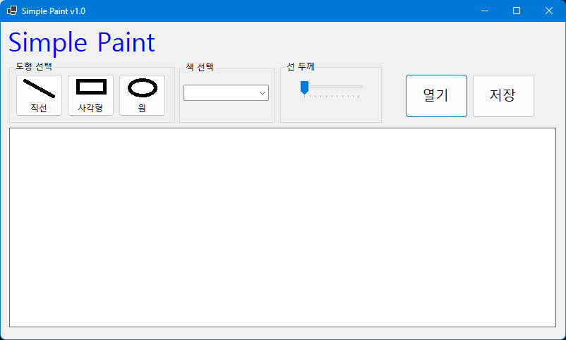
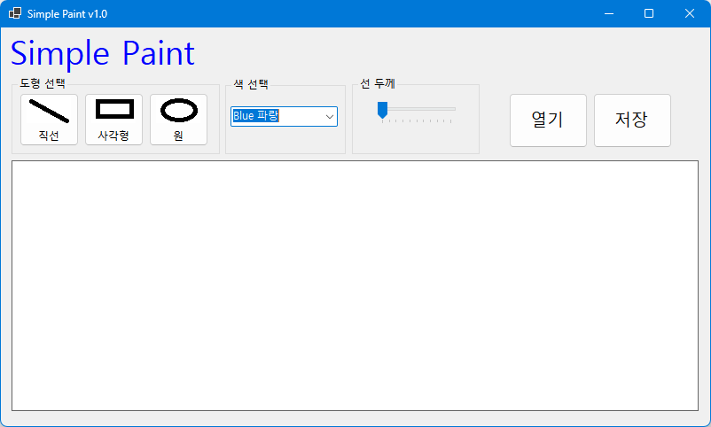
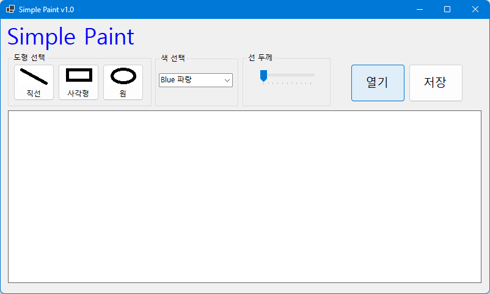
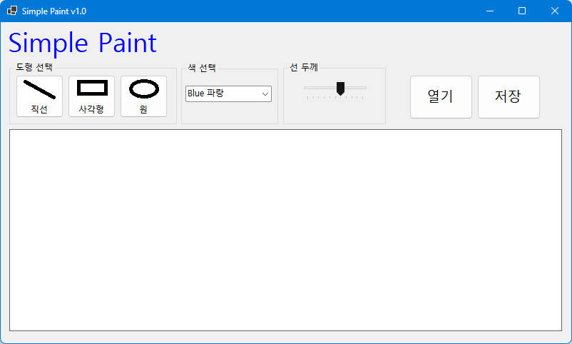
- 구현한 내용 (위 그림 참조)
	- UI 구성 : 직선, 사각형, 원을 그릴 수 있는 버튼, 색상 선택을 위한 ComboBox, 선 굵기 조절을 위한 TrackBar, 그림판 영역을 위한 PictureBox, 파일저장과 불러오기 버튼

## 실행 화면 (과제2)
- 코드의 실행 스크린샷과 구현 내용 설명
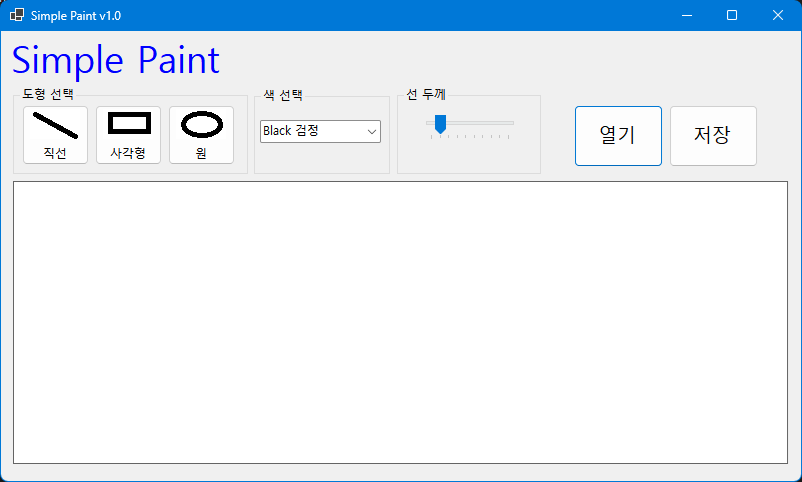
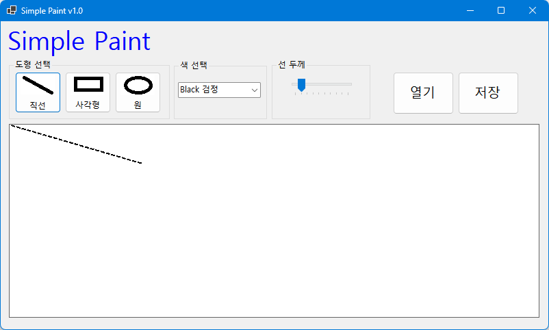
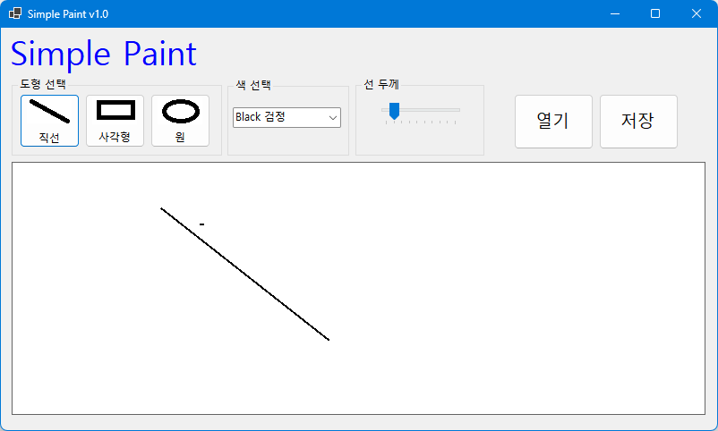
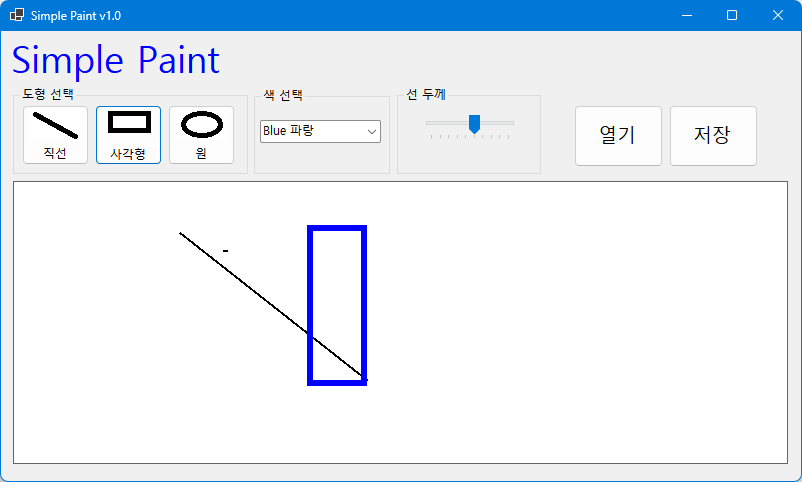
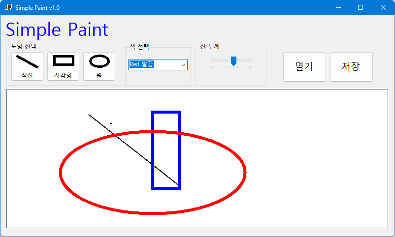
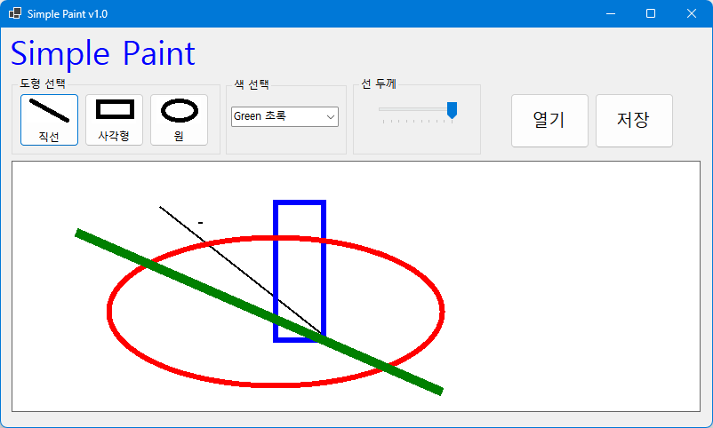
- 구현한 내용 (위 그림 참조)
	- 버튼을 클릭해서 직선, 사각형, 원을 선택하여 그릴 수 있도록 기능 구현
	- ComboBox에서 색상을 선택하여 선 색상을 변경할 수 있도록 기능 구현
	- TrackBar를 이용하여 선 굵기를 조절할 수 있도록 기능 구현
	- 점선을 통해 그려질 도형의 위치를 미리 보여주는 기능 구현
	- 마우스 이벤트를 이용하여 도형을 그리는 기능 구현
	- Paint 이벤트를 이용하여 도형을 PictureBox에 그리는 기능 구현

## 실행 화면 (과제3)
- 코드의 실행 스크린샷과 구현 내용 설명
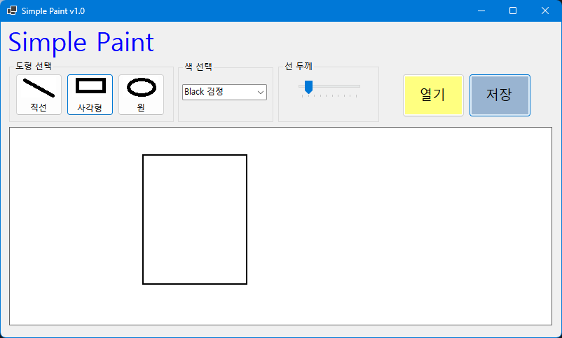
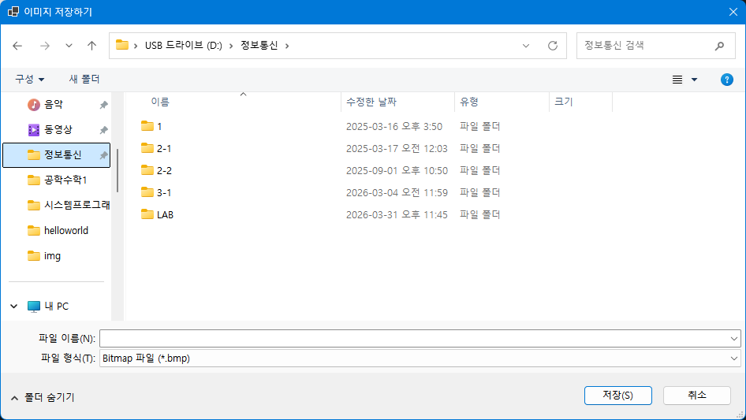
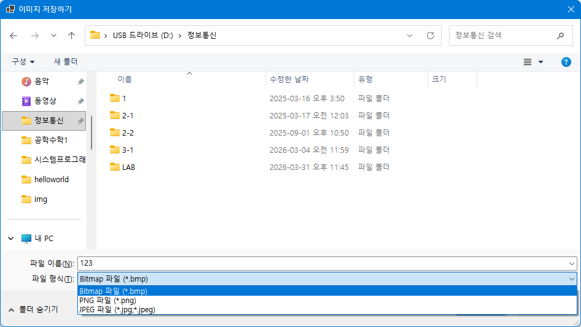
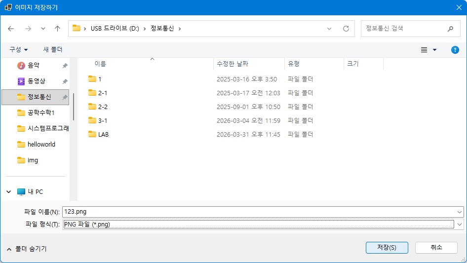
- 구현한 내용 (위 그림 참조)
	- 

## 실행 화면 (과제4)
- 코드의 실행 스크린샷과 구현 내용 설명

- 구현한 내용 (위 그림 참조)
	- 

## 배운 점
- 